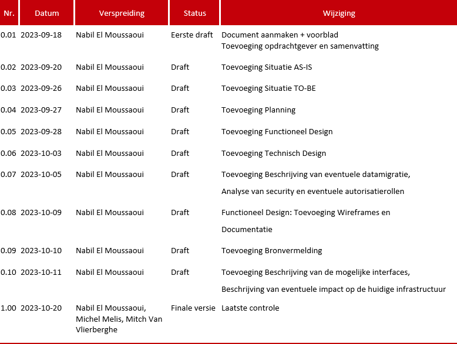
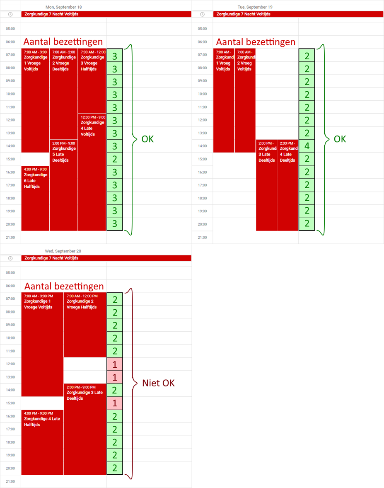

# Blueprint - Nabil El Moussaoui v1.0

[Demo](Documenten/resources/demo/README.md)

# Versiebeheer

_Tabel 1 - Versiebeheer tabel_

# Termen en Afkortingen

_Tabel 2 - Termen en afkortingen tabel_

# Opdrachtgever

Ventigrate specialiseert zich in digitale werkplekken en Microsoft-technologie-oplossingen. De aanpak combineert creativiteit en technische kennis. Ze bieden een traject van 3 maanden aan met interne en externe trainingen, coaching en toegang tot erkende opleidingen. Ventigrate is een IT-consultancybedrijf binnen de Cronos-groep, opgericht in 1993 door Dirk Deroost.

De opdrachtgever voor dit stageproject is Steven Van De Craen, een teamleider. Stagementors Michel Melis en Mitch Van Vlierberghe staan klaar om functionele en technische vragen te beantwoorden.

# Samenvatting

Er zou een applicatie moeten worden ontwikkeld die maandelijks gebruikt kan worden om de planning van ziekenhuispersoneel te maken. De tool moet rekening houden met verschillende regels, zoals onder andere: minimumbezetting, wensen & verlof van medewerkers, overuren, vroege/late/nacht shifts. De tool moet lokaal kunnen draaien op de laptop van de hoofdverpleegkundige en hem in staat stellen om via een gebruiksvriendelijke UI alle zorgkundigen en restricties in te voeren. Wanneer alle parameters zijn ingevoerd, moet de tool een overzichtelijk Excel-bestand als output genereren.

# Situatie As-Is

## Probleemstelling

De huidige omstandigheden in een woonzorgcentrum omvatten een team van verschillende zorgkundigen en een hoofdverpleegkundige. De vraag is: hoe worden hun dagen ingepland? De zorgkundigen moeten eerst en vooral hun verlofdagen doorgeven, ofwel via e-mail, ofwel vullen ze deze ter plaatse manueel in op een formulier bij de hoofdverpleegkundige. De hoofdverpleegkundige vult de verlofdagen van elke zorgkundige in een blanco Excel-bestand in. Hij of zij bekijkt hoeveel zorgkundigen er zijn en begint te puzzelen welke verlofdagen wel of niet passen voor elke zorgkundige in vergelijking met de andere zorgkundigen.

Dit is dus een echt handmatig proces dat elke maand wordt uitgevoerd. Het is ook moeilijk om de vorige spreadsheet als template te gebruiken, omdat elke maand natuurlijk anders is. De eerste dag van de maand begint op een andere weekdag. In vergelijking met de **huidige** situatie en de **gewenste** situatie, zou het zeker handig zijn dat ook de weekdagen automatisch correct worden weergegeven voor elke maand. 

De hoofdverpleegkundige is op de hoogte van de regimes van elke zorgkundige (wanneer ze voltijds, halftijds of deeltijds werken) en hun shifts (wanneer ze vroeg, laat of ’s nachts werken). De **huidige** situatie neemt veel tijd in beslag en is zeer arbeidsintensief voor de hoofdverpleegkundige.

## Situatie AS-IS

Op "Figuur 1 - AS-IS Activiteitendiagram" wordt de huidige aanpak tussen de zorgkundige en de hoofdverpleegkundige samengevat. Daarnaast biedt "Figuur 2 - AS-IS Toestandsdiagram" een weergave van de status van de verlofdagen tussen de hoofdverpleegkundige en de zorgkundigen. Dit wordt toegepast in de situatie wanneer de zorgkundige de verlofdagen via e-mail aangeeft. Hierbij wordt de mailservice gebruikt (Outlook.com, Gmail, …). Als de e-mail wordt gelezen door de hoofdverpleegkundige, kan men daaruit de status ‘ingelezen’ afleiden. Als er feedback wordt gegeven met de uren, kan men daaruit de status ‘geaccepteerd’ of ‘geweigerd’ afleiden. Tenslotte geeft ‘Figuur 3  - AS-IS Sequentiediagram’ een conceptuele representatie van hoe de hoofdverpleegkundige en de zorgkundige op een tijdlijn communiceren.

### _Activiteitendiagram_

_Figuur 1 - AS-IS Activiteitendiagram_

### _Toestandsdiagram_

_Figuur 2 - AS-IS Toestandsdiagram_

### _Sequentiediagram_

_Figuur 3 - AS-IS Sequentiediagram_

# Situatie To-Be

## Doelstelling

Zoals eerder vermeld in de samenvatting, moet ik een applicatie ontwikkelen waarmee maandelijks een planning wordt gemaakt voor het ziekenhuispersoneel. Deze planning moet aan veel regels voldoen voordat deze wordt opgesteld en geëxporteerd naar Excel.

Het doel is dat de hoofdverpleegkundige verschillende zorgkundige aanmaakt met hun shifts en verlofdagen in de planningstool en daarop gebaseerd een Excel-bestand genereert op basis van de toegelichte regels.

De eerste stap is werken aan de vereisten. De planningstool moet de mogelijkheid bieden om een maandplanning op te stellen voor 1 team in een woonzorgcentrum. Dit team bestaat alleen uit zorgkundigen. Hierbij kunnen ze voltijds, halftijds of deeltijds werken. Daarnaast kunnen ze in de vroege, late of nachtshift werken. Ze kunnen ook worden aangewezen als vaste nachtdienst.

De belangrijkste regel voor deze doelstelling is dat er **minimaal 2 zorgkundigen** aanwezig moeten zijn op de werkvloer (behalve ’s nachts, waar er minimaal 1 zorgkundige aanwezig mag zijn). Daarom moet er een methode zijn om aan deze regel te voldoen.

## Situatie TO-BE

### _ERD Schema_

_Figuur 4 - TO-BE ERD Schema_

### _Use-case Diagram_

_Figuur 5 - TO-BE Use-case Diagram_

### _Activiteitendiagram_

_Figuur 6 - TO-BE Activiteitendiagram_

1.	De hoofdverpleegkundige logt in op de webapplicatie.
2.	De hoofdverpleegkundige kiest een pagina waar aanpassingen nodig zijn (deze stap kan worden overgeslagen als er geen aanpassingen nodig zijn).
3.	Op die pagina kan de hoofdverpleegkundige een object aanmaken, wijzigen of verwijderen en na het beheren van de pagina wordt deze ook opgeslagen.
4.	Business regels bevatten constanten en regels van functies waar de hoofdverpleegkundige deze kan configureren.
5.	Er is ook een optie om de business regels terug te zetten naar de oorspronkelijke waarde.
6.	De hoofdverpleegkundige kiest of dat hij/zij de planning wil genereren door op een knop te drukken.
    - Deze stap kan ook worden overgeslagen.
    - De hoofdverpleegkundige kan ook teruggaan naar de homepagina.
7.	Is het mogelijk om de planning te genereren?
    - Ja, de planning is mogelijk om te generen en er wordt een melding getoond met eventuele waarschuwingen.
    - Nee, de planning is niet mogelijk om te genereren en er wordt een foutmelding weergegeven met de reden waarom dit niet mogelijk is en de gebruiker wordt terugverwezen naar de homepagina.
8.	De planning wordt weergegeven op een HTML-pagina en de gebruiker moet deze exporteren naar een Excel-bestand.
9.	Hoofdverpleegkundige logt uit.

## Scope

De scope omvat kort samengevat wat er binnen dit project wordt verwacht. In principe staat dit nog niet vast, aangezien er eventueel nog aanpassingen kunnen worden gemaakt. De regels worden gebruikt als validatiecriteria waaraan moet worden voldaan tijdens het genereren van de planning. De output is het uiteindelijke resultaat en wordt als een Excel-bestand verstrekt. De applicatie bestaat uit verschillende pagina's.

_Tabel 3 - Scope tabel_

De regel met betrekking tot de aanwezigheid van minimaal 2 zorgkundigen op de werkvloer ziet er als volgt uit. Als we kijken naar de overlappingen van 'Vroege' en 'Late' shifts, zien we in het eerste en tweede voorbeeld dat er nog steeds voldoende zorgkundigen aanwezig zijn. In het derde voorbeeld daarentegen zien we dat er gedurende 3 uur slechts één zorgkundige aanwezig is en dat mag niet het geval zijn. Deze tabel geeft een vereenvoudigd model weer van hoe deze regel werkt.

_Figuur 7 - Minimale bezetting van 2 zorgkundigen op werkvloer_

## Niet in Scope

-	De hoofdverpleegkundige als entiteit hoort niet bij in deze scope.
-	Login/Registratie Pagina voor de Hoofdverpleegkundige, omdat het lokaal wordt gedraaid op de werklaptop van de hoofdverpleegkundige.
-	Controleren van ADV dagen wordt niet besproken in deze scope.

## Nice-to-haves

Dit project bevat enkele 'nice-to-haves' met betrekking tot de uren en de wensen van zorgkundigen. Als er nog tijd beschikbaar is, kunnen we deze implementeren in het project:
-	Het bijhouden van overuren en minuren bijhouden per zorgkundige.
-	Het mogelijk maken voor zorgkundigen om ‘wensen’ in te voeren, waaronder terugkerende afwezigheidswensen, eenmalige afwezigheidswensen en aanwezigheidswensen:
    -	Een terugkerende afwezigheidswens geeft een medewerker bijvoorbeeld de optie om nooit op woensdagen te werken.
    -	Een eenmalige afwezigheidswens betekent dat een medewerker bijvoorbeeld op een specifieke dag niet wil werken, zonder dat dit als verlof wordt beschouwd.
    -	Een aanwezigheidswens houdt in dat een medewerker altijd op een specifieke dag van de week wil werken, bijvoorbeeld tijdens de vroege shift.
-	Tijdens de verwerking van de planning moet er ook rekening worden gehouden met de wensen van zorgkundigen. Als de planning niet realiseerbaar blijkt te zijn met inachtneming van de wensen, worden de wensen genegeerd.
-	Het beheren van wensen per zorgkundige.
-	Wensen worden automatisch weergegeven in de tabel, maar de planner heeft de mogelijkheid om ze te wijzigen of te verwijderen.
-	Extra verlof- en Adv-dagen kunnen worden gemarkeerd in de tabel.

# Planning

In dit project zullen we volgens een agile aanpak werken om het risico op falen te verminderen. Hierbij maken we gebruik van de Scrum-methodologie. Tijdens de projectuitvoering stellen we een back log op met user stories in de Azure DevOps-omgeving van het bedrijf. Enkele van de gekozen user stories voegen we toe aan het Scrum-bord voor voltooiing. De sprints worden elke 2 weken uitgevoerd. Als bepaalde user stories tijdens de sprint moeilijkheden opleveren, kunnen we deze meenemen naar de volgende sprint, maar het is belangrijk te benadrukken dat we ons richten op het verbeteren van deze problemen.

## Hoofdlijnen

_Tabel 4 - Hoofdlijnen planning met deadlines_

## Detailplanning

_Figuur 8 - Detailplanning_

# Functioneel design

De functionaliteiten worden al beschreven in de scope hierboven binnen deze blueprint. De schermen hoeven niet in elk geval in overeenstemming te zijn met de huisstijl van het bedrijf, maar het is wel handig om dat te doen. De pagina’s: zorgkundige, verlofdag, shift en zorgkundigeshift gebruiken allemaal een vorm van het CRUD-ontwerp, dat wil zeggen dat we op de pagina een object kunnen aanmaken, wijzigen en verwijderen. Bij het aanmaken van een teamplanning moeten er veel acties achter de schermen plaatsvinden wanneer de gebruiker op de knop drukt, namelijk:
-	Verzekeren van een minimale bezetting van 2 zorgkundigen op de werkvloer
-	Aanwezigheidsdagen berekenen
-	Handhaven van een minimale rustperiode van 35 uur in een volledige week
-	Tijdsinterval controleren tussen 2 opeenvolgende shifts
-	Voorkomen van opeenvolgende weekenddiensten voor zorgkundigen
-	Eerlijke verdeling van late shifts onder zorgkundigen
-	Beperkingen voor opeenvolgende late shifts en het totale aantal late shifts per week
-	Verwerking van verlof- en Adv-dagen tijdens het plannen
-	Weergave van resultaten in tabelvorm op een HTML-pagina

Nadat de teamplanning is gemaakt, kunnen er mogelijk foutmeldingen en/of waarschuwingsmeldingen verschijnen die aangeven dat het maken van het plan moeilijk is. Als er geen foutmeldingen zijn, kunnen we met de knop ‘Excel Icon’ de planning exporteren naar een Excel-bestand.

## Wireframes

De wireframes in dit document zijn momenteel conceptuele voorstellingen die het idee geven hoe de applicatie eruit kan zien. Er wordt achteraf enkele mooie modellen en styling gebruikt om de grafische gebruikersomgeving te verfijnen.

_Wireframe 1 - Zorgkundigelijst_

Dit is de zorgkundigen lijstpagina waar je een overzicht kan krijgen van de verschillende zorgkundigen. Je kunt hun gegevens hier ook beheren.

_Wireframe 2 - Zorgkundige aanmaken_

Dit is het zorgkundige formulier waarmee je een zorgkundige kunt aanmaken. Na het invullen van uw voornaam en achternaam, kan je een regime type selecteren namelijk ‘Voltijds (38 uren)’, ’Deeltijds 4/5’ (30.4 uren), 'Deeltijds 3/4 (28.8 uren)' of 'Halftijds (19 uren)'.

_Wireframe 3 & 4 - Zorgkundige wijzigen en verwijderen_

Dit is de zorgkundige formulier waar je een zorgkundige kan aanpassen of verwijderen.

_Wireframe 5 - Verlofdagenlijst_

Dit is de verlofdagen lijstpagina waar je een overzicht kan krijgen van de verschillende zorgkundigen hun verlofdagen.

_Wireframe 6 - Verlofdag maken_

Dit is de verlofdag form waar de hoofdverpleegkundige een verlof instelt voor een zorgkundige van een dag of een aantal dagen aan de hand van de ‘Startdatum’ en de ‘Einddatum’. De ‘VerlofType’ bevat: ‘Verlof’, ‘Ziekte’, ‘Adv-dag’, ‘Wens’, ‘Feestdag’ en ‘Andere’. De ‘Reden’ is een optionele beschrijving van het verlof.

_Wireframe 7 & 8 - Verlofdag wijzigen en verwijderen_

Dit is de verlofdag form waar de hoofdverpleegkundige een verlof aanpast of verwijdert.

_Wireframe 9 - Shiftslijst_

Dit is de shifts lijstenpagina waar je een overzicht kan krijgen van de verschillende shifts van wanneer tot wanneer een ‘Vroege’, ‘Late’ en de ‘Nacht’ shifts kunnen starten en eindigen. 

_Wireframe 10 - Shift aanmaken_

Dit is de shift form waar de hoofdverpleegkundige de shifts instelt. De tijdinstellingen kunnen aan de hand van de ‘ShiftType’ veranderd worden. Als je 'Vroege' selecteert, worden de 'Starttijd' en 'Eindtijd' aangepast aan hun respectieve begin- en einduren. In dit geval kunnen de tijden bijvoorbeeld van 7:00 uur tot 15:00 uur zijn.

_Wireframe 11 & 12 - Shift wijzigen en verwijderen_

Dit is de shift form waar de hoofdverpleegkundige een shift aanpast of verwijdert.

_Wireframe 13 - ZorgkundigeShifts lijst_

Dit is de zorgkundige shifts lijstenpagina waar je een overzicht kan krijgen van de verschillende zorgkundigen hun shifts.

_Wireframe 14 - ZorgkundigeShift aanmaken_

Dit is het zorgkundige shift formulier waar een hoofdverpleegkundige een zorgkundige shift kan aanmaken. Dit formulier is optioneel als men een specifieke zorgkundige wil inplannen. Normaal gesproken moet dit automatisch worden gegenereerd op basis van de verlofdagen van de zorgkundigen en dan moet het systeem een planning maken.

_Wireframe 15 & 16 - ZorgkundigeShift wijzigen en verwijderen_

In deze zorgkundige shift form kan de hoofdverpleegkundige en zorgkundige shift van een zorgkundige wijzigen of verwijderen.

_Wireframe 17 - Hoofdpagina_

Dit is de hoofdpagina waar je kan navigeren naar de verschillende pagina’s van de planningstool.

_Wireframe 18 - Teamplanning op een timeline_

De teamplanning pagina ziet er als volgt uit. Rechtsboven bevinden zich twee knoppen: 'Genereer planning' en een knop met een Excel-icoontje om de planning naar een Excel-bestand te exporteren. Aan de linker kant zie je twee tabbladen, namelijk 'Kalender' en 'Planning per zorgkundige'.

Op dit moment bevinden we ons op het tabblad 'Planning per zorgkundige'. Naast het tabblad staat een dropdownmenu waar een hoofdverpleegkundige de maand kan kiezen waarvoor de planning wordt gegenereerd. Dit dropdownmenu werkt op basis van de huidige datum. Bijvoorbeeld, als je momenteel in augustus 2022 bent, begint de dropdown in 'September - 2022' en eindigt met 'Augustus - 2023'. Dit zorgt ervoor dat we bijvoorbeeld geen planning genereren voor 'Augustus - 2022'.

_Wireframe 19 - Foutmelding Modal_

Als 'Genereer planning' niet werkt, verschijnt er een foutmeldingsvenster met de reden waarom het niet werkt.

_Wireframe 20 - Waarschuwingsmelding Modal_

Als 'Genereer planning' wel werkt, kan er ook een waarschuwing verschijnen met de reden waarom het niet van toepassing is. In dat geval kun je op de knop 'Verder' drukken als je toch de planning wilt genereren.

_Wireframe 21 - Teamplanning op een kalender_

Bij overschakeling naar het volgende tabblad, genaamd 'Kalender', zie je de kalender van onze teamplanning met een zorgkundige die op een bepaalde datum is ingepland. Als er te veel zorgkundigen zijn op dezelfde datum, kun je erop klikken, waarna er een detailvenster verschijnt waarin de zorgkundigen zijn gegroepeerd per datum. Als je op de 'Lijst' knop drukt, ga je naar 'Wireframe 21 - Teamplanning op een kalender'. Met de 'Terug' knop sluit je de modale weergave en keer je terug naar de teamplanning pagina.

## Output

_Figuur 9 - Gegenereerde Excel_

Dit is een visuele representatie van hoe de gegenereerde Excel eruit moet zien. De zorgkundigen bevinden zich aan de linkerkant in verschillende rijen en de dagen staan bovenaan in kolommen. In elke cel moet ofwel een zorgkundige shift ofwel een verlofdag worden weergegeven. 

# Technische design

## N-Laagse Architectuur

Door de code in afzonderlijke lagen te verdelen, wordt het gemakkelijker om wijzigingen aan te brengen zonder de hele applicatie te beïnvloeden en dit betekent dat delen van het systeem onafhankelijk kunnen worden ontwikkeld, onderhouden en getest. De componenten in de N-Laagse architectuur kunnen vaak worden hergebruikt in verschillende projecten, waardoor de ontwikkeltijd wordt verminderd.

We gebruiken een N-Laagse architectuur, die bestaat uit de volgende lagen: de Data Access Layer, de Business Logic/Service Layer, de API Layer en de Presentation Layer. In de Data Access Layer bevinden zich alle objecten en logica die te maken hebben met toegang tot de database en alle objecten en logica met betrekking tot EF Core bevinden zich in deze laag. De Business Logic/Service Layer bevat alle objecten en logica die verband houden met de business rules. De API Layer bevat alle objecten en logica die nodig zijn om informatie via HTTP naar de presentatie laag te sturen. Ten slotte bevinden alle objecten en logica die nodig zijn om de gebruikersinterface te ontwikkelen zich in de Presentation Layer.

_Figuur 10 - N-Laagse Architectuur_

Dit diagram geeft de stroom van links naar rechts weer, waarbij we verzoeken van de gebruikersinterface naar rechts door de lagen gaan en de resultaten terug naar links tot de Presentation Layer worden doorgegeven:
-	De Gebruikersinterface communiceert met de API Layer om verzoeken te initiëren.
-	De API Layer verzendt deze verzoeken naar de Business Logic/Service Layer.
-	De Business Logic/Service Layer voert de benodigde bewerkingen uit, inclusief de communicatie met de Data Access Layer om gegevens op te halen of bij te werken.
-	De Data Access Layer communiceert rechtstreeks met de database om gegevens op te halen of bij te werken.

## Technologieën

|  |  |
| ---- | ---- |
|  _Figuur 11 - React Logo_ | De front-end-technologie wordt ontwikkeld in React. Er zal een webapplicatie gemaakt worden op dit gebied. React is een JavaScript-bibliotheek die gebruikt wordt voor het bouwen van gebruikersinterfaces. Bovendien wordt React veel keren gedownload volgens de trends van NPM (Node Package Manager). De grootste kracht van React zijn de herbruikbare componenten. Je bouwt kleine onderdelen, die je vervolgens kunt hergebruiken in je applicatie.  |

Net als andere JavaScript-bibliotheken maakt React gebruik van Single Page Applications (SPA's), wat inhoudt dat er slechts één html-bestand wordt gebruikt. Hierdoor is het niet nodig om bij het navigeren naar een andere pagina een nieuw html-bestand te laden. Bij het betreden van de site worden de JavaScript-bestanden geladen. Wanneer er wordt overgeschakeld naar andere pagina's, vindt er geen nieuwe serververbinding plaats om de pagina te laden. In plaats daarvan wordt alle benodigde inhoud in één keer geladen, wat eerder enige tijd kan kosten. Echter, nadat alles is geladen, resulteert dit in aanzienlijk snellere prestaties.

_Figuur 12 - React Single Page Application_

|  |  |
| ---- | ---- |
|  _Figuur 13 - .NET Core Logo_ | De front-end-technologie wordt ontwikkeld in React. Er zal een webapplicatie gemaakt worden op dit gebied. React is een JavaScript-bibliotheek die gebruikt wordt voor het bouwen van gebruikersinterfaces. Bovendien wordt React veel keren gedownload volgens de trends van NPM (Node Package Manager). De grootste kracht van React zijn de herbruikbare componenten. Je bouwt kleine onderdelen, die je vervolgens kunt hergebruiken in je applicatie.  |
|   _Figuur 14 - Microsoft SQL Server Logo_ | De front-end-technologie wordt ontwikkeld in React. Er zal een webapplicatie gemaakt worden op dit gebied. React is een JavaScript-bibliotheek die gebruikt wordt voor het bouwen van gebruikersinterfaces. Bovendien wordt React veel keren gedownload volgens de trends van NPM (Node Package Manager). De grootste kracht van React zijn de herbruikbare componenten. Je bouwt kleine onderdelen, die je vervolgens kunt hergebruiken in je applicatie.  |
|   _Figuur 15 - Azure SQL Database Logo_ | De front-end-technologie wordt ontwikkeld in React. Er zal een webapplicatie gemaakt worden op dit gebied. React is een JavaScript-bibliotheek die gebruikt wordt voor het bouwen van gebruikersinterfaces. Bovendien wordt React veel keren gedownload volgens de trends van NPM (Node Package Manager). De grootste kracht van React zijn de herbruikbare componenten. Je bouwt kleine onderdelen, die je vervolgens kunt hergebruiken in je applicatie.  |
|   _Figuur 16 - Azure DevOps Logo_ | De front-end-technologie wordt ontwikkeld in React. Er zal een webapplicatie gemaakt worden op dit gebied. React is een JavaScript-bibliotheek die gebruikt wordt voor het bouwen van gebruikersinterfaces. Bovendien wordt React veel keren gedownload volgens de trends van NPM (Node Package Manager). De grootste kracht van React zijn de herbruikbare componenten. Je bouwt kleine onderdelen, die je vervolgens kunt hergebruiken in je applicatie.  |

# Beschrijving van de mogelijke interfaces

De applicatie is ontworpen als een volledig op zichzelf staand systeem, zonder de noodzaak van gegevensuitwisseling of synchronisatie met externe systemen in contact te komen. Als gevolg hiervan zijn de mogelijke interfaces voor deze applicatie intern gericht en beperkt tot de gebruikerservaring binnen de applicatie zelf. De hoofdverpleegkundige communiceert rechtstreeks met de applicatie via de gebruikersinterface op zijn of haar werklaptop.

# Beschrijving van eventuele datamigratie

Aangezien er in de werkelijkheid geen exacte AS-IS situatie is, is er geen optie om een Excel-bestand in het systeem te importeren. Datamigratie is een complex proces dat afhankelijk is van specifieke systemen. In dit geval gaat het om de gegevensstructuur. Als de gegevens in het ene systeem een volledig andere structuur hebben dan in het andere systeem, kan datamigratie problematisch zijn. Hoewel de hoofdverpleegkundige inderdaad met een Excel-bestand werkt, is de manier waarop die de planningsstructuur opbouwt volledig anders dan hoe dit in het systeem wordt aangepakt. In dit geval is datamigratie echter niet van toepassing.

# Beschrijving van eventuele impact op de huidige infrastructuur

De impact op de huidige infrastructuur verschaft inzicht in de relevante factoren voor de implementatie van de applicatie. Hierbij wordt een Azure-omgeving voorzien waarin de applicatie draait. Azure is een Cloud computing-platform dat wordt beheerd en onderhouden door Microsoft. Azure stelt bedrijven in staat om IT-infrastructuur en applicaties in de Cloud te implementeren, beheren en schalen, in plaats van fysieke servers te gebruiken. 

De hoofdverpleegkundige kan eenvoudig hun werklaptop gebruiken om toegang te krijgen tot de webapplicatie. Dit betekent dat de laptop moet voldoen aan bepaalde systeemvereisten om de applicatie soepel te laten draaien. 

Het ontwikkelen van een gebruiksvriendelijke gebruikersinterface is belangrijk om ervoor te zorgen dat de hoofdverpleegkundige efficiënt met de applicatie kan werken.

_Figuur 17 - Deployment diagram_

# Analyse van security en eventuele autorisatierollen

Met betrekking tot de loginpagina, overwegen we momenteel om dit als een uitbreiding toe te voegen aan het bestaande project. Momenteel valt het inloggedeelte niet binnen de oorspronkelijke scope van het project en is het de bedoeling dat dit gewoon functioneert op de werklaptop van de hoofdverpleegkundige.

# Documentatie

Het is belangrijk dat alles goed gedocumenteerd wordt. Het is essentieel dat de webapplicatie volledig functioneert zoals bedoeld. Voor dit project zal er een technische documentatie worden opgesteld die de werking van de applicatie beschrijft. Bovendien zal de code worden gedocumenteerd, zowel voor de API als voor de functies. De API-specificaties worden vastgelegd met behulp van Swagger. Bij de front-end ontwikkeling worden functies gedocumenteerd door commentaar toe te voegen.

# Bronvermelding

|  |  |
| ---- | ---- |
| [1] | Stages - Ventigrate Academy. (2021, November 30). Ventigrate Academy. Opgehaald van https://academy.ventigrate.be/stages/ |
| [2] | Ventigrate NV. (2023, October 6). Microsoft 365 Partner - Innoveren, excelleren en integreren met Ventigrate. Ventigrate. Opgehaald van https://www.ventigrate.be/ |
| [3] | Wat is GIT en wat is GitHub? - Kort. (2020, November 9). Opgehaald van https://axxius.nl/kennisbank/automation-software-tools/wat-is-git-wat-is-github/#:~:text=Git%20is%20een%20systeem%20voor,repository%20of%20repo%20wordt%20genoemd |
| [4] | Zang, A. (2021, November 19). ASP.NET Core for Beginners: Web APIs. Telerik Blogs. Opgehaald van https://www.telerik.com/blogs/aspnet-core-beginners-web-apis#:~:text=An%20ASP.NET%20Core%20Web,for%20working%20with%20HTTP%20requests |
| [5] | Digital-Delivery-Operations. (2023, August 30). Wat is een API en wat kan je ermee? - Salesforce Nederland Blog. Salesforce. Opgehaald van https://www.salesforce.com/nl/blog/wat-is-een-api/ |
| [6] | Actian. (2023, September 24). Define SQL Server: a Comprehensive Guide. Opgehaald van https://www.actian.com/what-is-sql-server/#:~:text=Microsoft%20SQL%20Server%20is%20a,internet%20as%20a%20web%20service |
| [7] | Mol, N. (2021, July 25). React JS: Wat is het en waarom word het zo vaak gebruikt? Opgehaald van https://cbi-analytics.nl/react-js-wat-is-het-en-waarom-word-het-zo-vaak-gebruikt/ |
| [8] | Wat doet een IT-consultant? - stepstone.be. (n.d.). stepstone.be. Opgehaald van  https://www.stepstone.be/carriere-tips/wat-doet-een-consultant/ |
| [9] | PerfectXL. (2021, June 9). Wat is een spreadsheet // Verklarende woordenlijst Excel // PerfectXL. Opgehaald van https://www.perfectxl.com/excel-verklarende-woordenlijst/wat-is-een-spreadsheet/?lang=nl |
| [10] | StudentJob.Be. (n.d.). ADV-dagen \| ATV-dagen \| Alles wat je moet weten \| St. . . StudentJob BE NL. Opgehaald van https://www.studentjob.be/carriere/secundaire-arbeidsvoorwaarden/adv-dagen |
| [11] | Twize B.V. (2023, May 30). Wat is Agile? Een kort overzicht met video uitleg. Organize Agile. Opgehaald van https://www.organizeagile.nl/wat-is-agile/ |
| [12] | User Story \| Scrumguide.nl. (2020, December 27). Scrumguide. Opgehaald van https://scrumguide.nl/user-story/#:~:text=Een%20User%20Story%20is%20een,het%20product%20moet%20%2F%20wil%20doen. |
| [13] | Osman, J. (2023). CRUD Operations - Wat is CRUD? AppMaster - Ultimate All-in No-code Platform. Opgehaald van https://appmaster.io/nl/blog/crud-operations-wat-is-crud |
| [14] | Wat is DevOps? Uitleg over DevOps \| Microsoft Azure. (n.d.). Opgehaald van https://azure.microsoft.com/nl-nl/resources/cloud-computing-dictionary/what-is-devops#:~:text=Definitie%20van%20DevOps,waarde%20aan%20klanten%20te%20bieden |
| [15] | Contributor, T. (2019). clean architecture. WhatIs.com. Opgehaald van https://www.techtarget.com/whatis/definition/clean-architecture#:~:text=Clean%20architecture%20is%20a%20software,separate%20from%20the%20delivery%20mechanism |
| [16] | Abramowski, N. (2022, November 28). What is NPM? The Complete 2023 Beginner's Guide. CareerFoundry. Opgehaald van https://careerfoundry.com/en/blog/web-development/what-is-npm/#what-is-npm |
| [17] | SSL Corp. (2021, October 13). What is HTTPS? - SSL.com. SSL.com. Opgehaald van https://www.ssl.com/faqs/what-is-https/ |
| [18] | Simplilearn. (2023). DBMS vs RDBMS: Everything You Need to Know. Simplilearn.com. Opgehaald van https://www.simplilearn.com/tutorials/dbms-tutorial/dbms-vs-rdbms#what_is_rdbms |
| [19] | Gewarren. (2023, March 24). .NET (and .NET Core) - introduction and overview - .NET. Opgehaald van Microsoft Learn. https://learn.microsoft.com/en-us/dotnet/core/introduction |
| [20] | Microsoft Azure storing? Actuele storingen en problemen. Opgehaald van https://allestoringen.nl/storing/windows-azure/ |
| [21] | What is Swagger. (n.d.). Opgehaald van https://swagger.io/docs/specification/2-0/what-is-swagger/ |
| [22] | Juviler, J. (2022, April 1). What Is a Modal and When Should I Use One? Opgehaald van https://blog.hubspot.com/website/modal-web-design |
| [23] | Me, H. I. (2022, December 9). Wat is UI (User Interface) \| hello it's me. Hello It’s Me. https://www.helloitsme.online/gratis-kennis/wat-is-ui-user-interface/ |
| [24] | Node Package Manager | Studieanker. (n.d.). https://www.studieanker.be/node/ch4-npm_packages.html#inleiding |

# Bijlagen

Backlog - [Nabil El Moussaoui v1.0.xlsx](Documenten/resources/Backlog%20-%20Nabil%20El%20Moussaoui%20v1.0.xlsx)
